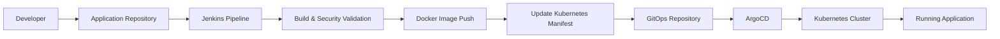

# 🧳 Wanderlust DevSecOps GitOps Infrastructure

> A production-style DevSecOps and GitOps implementation for the Wanderlust application using Jenkins, SonarQube, Trivy, Docker, Kubernetes, ArgoCD, Prometheus, Grafana, and Alertmanager.

---

## 📖 Project Overview

The **Wanderlust DevSecOps GitOps Infrastructure** repository manages the Kubernetes deployment and operational lifecycle of the Wanderlust application using GitOps principles.

This project demonstrates a complete end-to-end DevSecOps workflow, starting from source code integration and security scanning to automated deployment, continuous monitoring, and alerting.
 
The infrastructure is designed to simulate a real-world production environment by integrating CI/CD, containerization, Kubernetes orchestration, GitOps automation, observability, and proactive monitoring.

### Key Objectives

- Automate application deployment using GitOps.
- Improve software quality through static code analysis.
- Perform container security scanning before deployment.
- Deploy applications on Kubernetes using ArgoCD.
- Monitor cluster and application health using Prometheus.
- Visualize metrics using Grafana dashboards.
- Generate alerts using Alertmanager and custom Prometheus alert rules.

---

## 🏗️ Solution Architecture
  
---

## 🏗️ Architecture

The project follows a modern DevSecOps and GitOps workflow where every code change is automatically validated, secured, deployed, monitored, and continuously reconciled with the desired Kubernetes state.

The workflow consists of the following stages:

1. Source Code Management
2. Continuous Integration (Jenkins)
3. Static Code Analysis (SonarQube)
4. Container Security Scanning (Trivy)
5. Docker Image Build & Push
6. GitOps Manifest Update
7. Continuous Deployment (ArgoCD)
8. Kubernetes Deployment
9. Monitoring (Prometheus)
10. Visualization (Grafana)
11. Alerting (Alertmanager)

This architecture separates application delivery from infrastructure management, ensuring reproducibility, traceability, and automated recovery from configuration drift.

---

## 🛠️ Technology Stack

| Category | Technologies |
|----------|--------------|
| Version Control | Git, GitHub |
| Continuous Integration | Jenkins |
| Code Quality | SonarQube |
| Security Scanning | Trivy |
| Containerization | Docker |
| Container Registry | Docker Hub |
| Orchestration | Kubernetes (Kind) |
| GitOps | ArgoCD |
| Monitoring | Prometheus |
| Visualization | Grafana |
| Alerting | Alertmanager |
| Operating System | Ubuntu Linux |

---
---

## 🚀 DevSecOps CI/CD Pipeline

The project implements an automated DevSecOps pipeline that integrates continuous integration, security scanning, containerization, GitOps deployment, and monitoring. Every code change follows a standardized workflow before reaching the Kubernetes cluster.

```text
Developer
    │
    ▼
GitHub
    │
    ▼
Jenkins
    │
    ├── Checkout Source Code
    ├── Build Application
    ├── SonarQube Analysis
    ├── Quality Gate
    ├── Trivy Security Scan
    ├── Build Docker Images
    ├── Push Images to Docker Hub
    ├── Update GitOps Repository
    ▼
ArgoCD
    ▼
Kubernetes
    ▼
Prometheus
    ▼
Grafana
    ▼
Alertmanager
```

### Pipeline Stages

| Stage | Description |
|--------|-------------|
| Source Control | Developers push code changes to GitHub. |
| Continuous Integration | Jenkins automatically triggers the pipeline. |
| Code Quality | SonarQube performs static code analysis and validates code quality. |
| Security Scan | Trivy scans container images for known vulnerabilities. |
| Containerization | Docker builds and pushes images to Docker Hub. |
| GitOps Deployment | Jenkins updates Kubernetes manifests in the GitOps repository. |
| Continuous Deployment | ArgoCD synchronizes the desired state with the Kubernetes cluster. |
| Monitoring | Prometheus collects infrastructure and application metrics. |
| Visualization | Grafana displays dashboards for real-time monitoring. |
| Alerting | Alertmanager sends notifications based on Prometheus alert rules. |

---
---

## 🔄 GitOps Workflow

The project follows a GitOps-based deployment model where Git acts as the single source of truth for Kubernetes application configuration.

Instead of directly deploying applications from the CI pipeline, Jenkins updates the GitOps repository with the latest deployment changes. ArgoCD continuously monitors the repository and automatically synchronizes the desired state with the Kubernetes cluster.



### GitOps Process

| Step | Description |
|------|-------------|
| 1 | Developer pushes application code changes to GitHub. |
| 2 | Jenkins executes CI pipeline for build, testing, quality analysis, and security scanning. |
| 3 | Docker images are built and pushed to the container registry. |
| 4 | Kubernetes manifest files are updated in the GitOps repository. |
| 5 | ArgoCD detects repository changes automatically. |
| 6 | ArgoCD synchronizes the desired configuration with Kubernetes. |
| 7 | Kubernetes maintains the application state using declarative manifests. |

### GitOps Benefits

- Declarative infrastructure management.
- Git as the single source of truth.
- Automated deployment synchronization.
- Easy rollback using Git history.
- Improved deployment visibility and auditability.

---
