# 🧳 Wanderlust DevSecOps GitOps Infrastructure

> A production-style DevSecOps and GitOps implementation for the Wanderlust application using Jenkins, SonarQube, Trivy, Docker, Kubernetes, ArgoCD, Prometheus, Grafana, and Alertmanager.

--- 

## 📖 Project Overview

The **Wanderlust DevSecOps GitOps Infrastructure** repository manages the Kubernetes deployment and operational lifecycle of the Wanderlust application using GitOps principles.

This project demonstrates a complete end-to-end DevSecOps workflow, starting from source code integration and security scanning to automated deployment, continuous monitoring, and alerting.
 
The infrastructure is designed to simulate a real-world production environment by integrating CI/CD, containerization, Kubernetes orchestration, GitOps automation, observability, and proactive monitoring.

### Key Objectives

- Automate application deployment using GitOps.
- Improve software quality through static code analysis.
- Perform container security scanning before deployment.
- Deploy applications on Kubernetes using ArgoCD.
- Monitor cluster and application health using Prometheus.
- Visualize metrics using Grafana dashboards.
- Generate alerts using Alertmanager and custom Prometheus alert rules.

---

## 🏗️ Solution Architecture
  
---

## 🏗️ Architecture

The project follows a modern DevSecOps and GitOps workflow where every code change is automatically validated, secured, deployed, monitored, and continuously reconciled with the desired Kubernetes state.

The workflow consists of the following stages:

1. Source Code Management
2. Continuous Integration (Jenkins)
3. Static Code Analysis (SonarQube)
4. Container Security Scanning (Trivy)
5. Docker Image Build & Push
6. GitOps Manifest Update
7. Continuous Deployment (ArgoCD)
8. Kubernetes Deployment
9. Monitoring (Prometheus)
10. Visualization (Grafana)
11. Alerting (Alertmanager)

This architecture separates application delivery from infrastructure management, ensuring reproducibility, traceability, and automated recovery from configuration drift.

---

## 🛠️ Technology Stack

| Category | Technologies |
|----------|--------------|
| Version Control | Git, GitHub |
| Continuous Integration | Jenkins |
| Code Quality | SonarQube |
| Security Scanning | Trivy |
| Containerization | Docker |
| Container Registry | Docker Hub |
| Orchestration | Kubernetes (Kind) |
| GitOps | ArgoCD |
| Monitoring | Prometheus |
| Visualization | Grafana |
| Alerting | Alertmanager |
| Operating System | Ubuntu Linux |

---
---

## 🚀 DevSecOps CI/CD Pipeline

The project implements an automated DevSecOps pipeline that integrates continuous integration, security scanning, containerization, GitOps deployment, and monitoring. Every code change follows a standardized workflow before reaching the Kubernetes cluster.

```text
Developer
    │
    ▼
GitHub
    │
    ▼
Jenkins
    │
    ├── Checkout Source Code
    ├── Build Application
    ├── SonarQube Analysis
    ├── Quality Gate
    ├── Trivy Security Scan
    ├── Build Docker Images
    ├── Push Images to Docker Hub
    ├── Update GitOps Repository
    ▼
ArgoCD
    ▼
Kubernetes
    ▼
Prometheus
    ▼
Grafana
    ▼
Alertmanager
```

### Pipeline Stages

| Stage | Description |
|--------|-------------|
| Source Control | Developers push code changes to GitHub. |
| Continuous Integration | Jenkins automatically triggers the pipeline. |
| Code Quality | SonarQube performs static code analysis and validates code quality. |
| Security Scan | Trivy scans container images for known vulnerabilities. |
| Containerization | Docker builds and pushes images to Docker Hub. |
| GitOps Deployment | Jenkins updates Kubernetes manifests in the GitOps repository. |
| Continuous Deployment | ArgoCD synchronizes the desired state with the Kubernetes cluster. |
| Monitoring | Prometheus collects infrastructure and application metrics. |
| Visualization | Grafana displays dashboards for real-time monitoring. |
| Alerting | Alertmanager sends notifications based on Prometheus alert rules. |

---
---

## 🔄 GitOps Workflow

The project follows a GitOps-based deployment model where Git acts as the single source of truth for Kubernetes application configuration.

Instead of directly deploying applications from the CI pipeline, Jenkins updates the GitOps repository with the latest deployment changes. ArgoCD continuously monitors the repository and automatically synchronizes the desired state with the Kubernetes cluster.

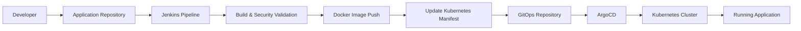

### GitOps Process

| Step | Description |
|------|-------------|
| 1 | Developer pushes application code changes to GitHub. |
| 2 | Jenkins executes CI pipeline for build, testing, quality analysis, and security scanning. |
| 3 | Docker images are built and pushed to the container registry. |
| 4 | Kubernetes manifest files are updated in the GitOps repository. |
| 5 | ArgoCD detects repository changes automatically. |
| 6 | ArgoCD synchronizes the desired configuration with Kubernetes. |
| 7 | Kubernetes maintains the application state using declarative manifests. |

### GitOps Benefits

- Declarative infrastructure management.
- Git as the single source of truth.
- Automated deployment synchronization.
- Easy rollback using Git history.
- Improved deployment visibility and auditability.

---
---

---

## 📊 Monitoring & Observability

The Wanderlust platform includes a complete monitoring and observability stack to track Kubernetes cluster health, application performance, and operational metrics.

The monitoring architecture uses Prometheus for metrics collection, Grafana for visualization, and Alertmanager for intelligent alert handling.

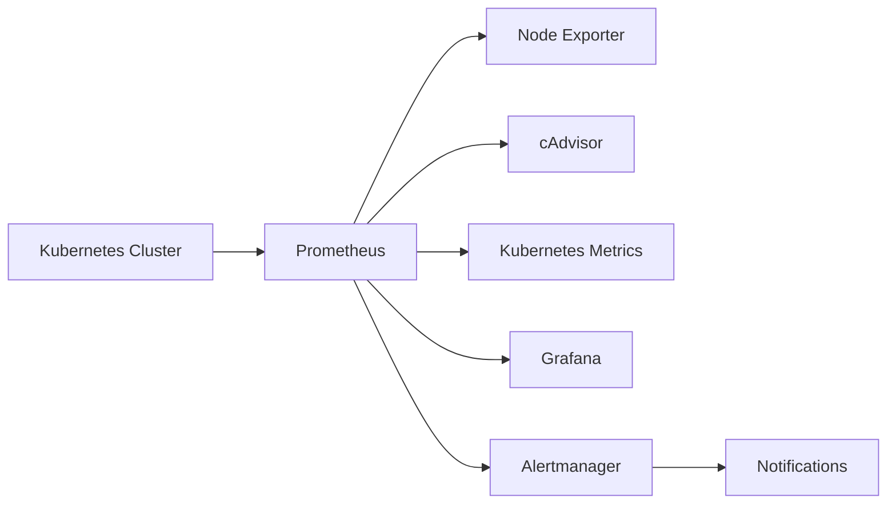

### Monitoring Components

| Component | Purpose |
|-----------|---------|
| Prometheus | Collects and stores time-series metrics from Kubernetes and application workloads. |
| Grafana | Provides interactive dashboards for monitoring infrastructure and application performance. |
| Alertmanager | Processes Prometheus alerts and sends notifications based on defined rules. |
| Node Exporter | Collects host-level metrics such as CPU, memory, disk, and network usage. |
| cAdvisor | Provides container-level resource usage and performance metrics. |
| Kubernetes Metrics | Provides cluster and workload health information. |

### Observability Features

- Real-time Kubernetes cluster monitoring.
- Application and container resource tracking.
- CPU, memory, disk, and network utilization monitoring.
- Custom Prometheus alert rules.
- Grafana dashboards for visualization.
- Alert-based incident detection.

---
---

## 🔐 Security Features

Security is integrated throughout the software delivery lifecycle by implementing automated code analysis, vulnerability scanning, and secure container practices.

The project follows a DevSecOps approach where security checks are performed during the CI pipeline before application deployment.

### Security Components

| Component | Purpose |
|-----------|---------|
| SonarQube | Performs static code analysis to identify code quality issues, bugs, and security vulnerabilities. |
| Quality Gate | Ensures that code meets defined quality standards before continuing the pipeline. |
| Trivy | Scans Docker images for known vulnerabilities and security risks. |
| Docker Security Practices | Uses optimized container images and secure image-building practices. |
| GitOps Security | Maintains version-controlled Kubernetes configurations with complete audit history. |

### Security Workflow

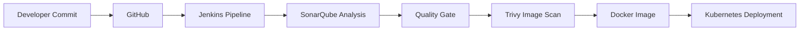

### DevSecOps Benefits

- Early detection of code vulnerabilities.
- Automated security validation during CI.
- Reduced risk of deploying vulnerable container images.
- Traceable changes through Git history.
- Improved application reliability and security posture.

---
---

# 📸 CI/CD Pipeline

The project implements a production-style CI/CD pipeline using Jenkins. Every code change triggers an automated workflow that performs source code checkout, static code analysis, security scanning, Docker image creation, image publishing, and GitOps repository updates.

### Jenkins Pipeline Stage View

The Jenkins pipeline automates the complete DevSecOps workflow from source code checkout to GitOps deployment.

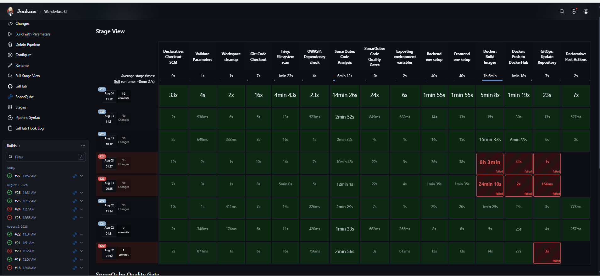

### SonarQube Quality Gate

The Quality Gate ensures that only code meeting predefined quality standards proceeds further in the deployment pipeline.

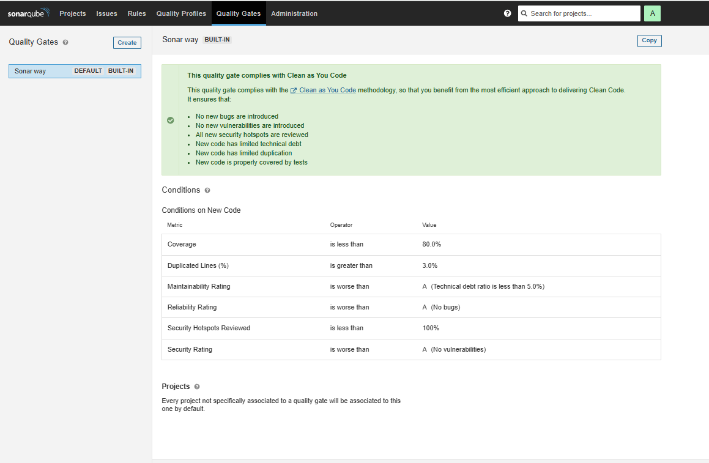
### Docker Image Registry

After successful validation, versioned Docker images are automatically pushed to Docker Hub, enabling Kubernetes deployments through GitOps.

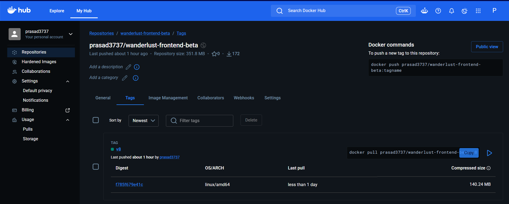

### SonarQube Dashboard

SonarQube performs static code analysis to identify bugs, code smells, vulnerabilities, and maintainability issues before deployment.

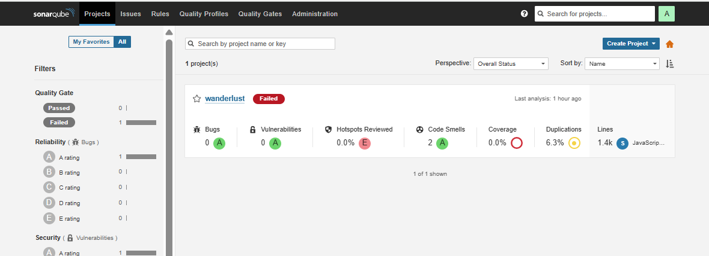

---

# 🚀 GitOps Deployment

The project follows GitOps principles using ArgoCD. Once Jenkins updates the Kubernetes manifests in the GitOps repository with the latest Docker image tags, ArgoCD automatically detects the changes, synchronizes the desired state, and deploys the updated application to the Kubernetes cluster.

This approach ensures declarative deployments, version-controlled infrastructure, automated synchronization, and simplified rollback capabilities.

### ArgoCD Dashboard

The ArgoCD dashboard continuously monitors the GitOps repository and keeps the Kubernetes cluster synchronized with the desired application state.

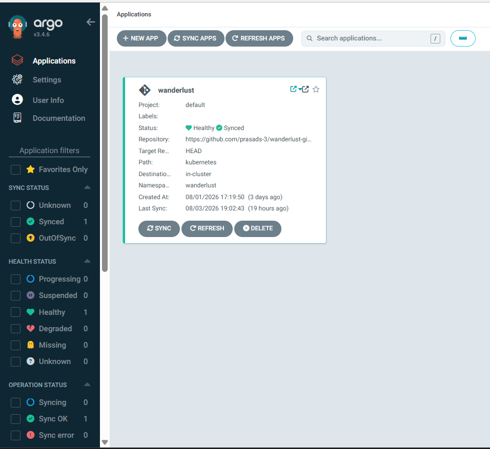
---

# ☸️ Kubernetes Deployment

The Wanderlust application is deployed on a Kubernetes cluster using declarative manifests. The deployment includes frontend, backend, MongoDB, Redis, services, persistent storage, and networking resources managed through Kubernetes.

### Running Kubernetes Pods

The following screenshot shows all application components successfully running inside the Kubernetes cluster.

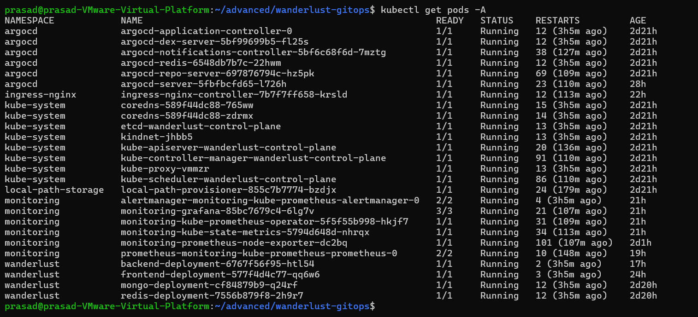
---

# 📊 Monitoring & Observability

The monitoring stack is built using Prometheus, Grafana, and Alertmanager to provide real-time visibility into the Kubernetes cluster and application health.

Prometheus continuously collects metrics from Kubernetes components and workloads, Grafana visualizes these metrics through interactive dashboards, and Alertmanager manages alert notifications based on custom Prometheus rules.
### Prometheus Targets

Prometheus successfully discovers and scrapes metrics from Kubernetes components, ensuring continuous monitoring across the cluster.

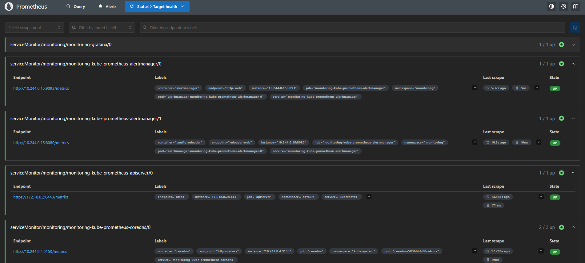
### Prometheus Alert Rules

Custom alert rules continuously monitor the application and cluster health to detect failures and abnormal conditions.

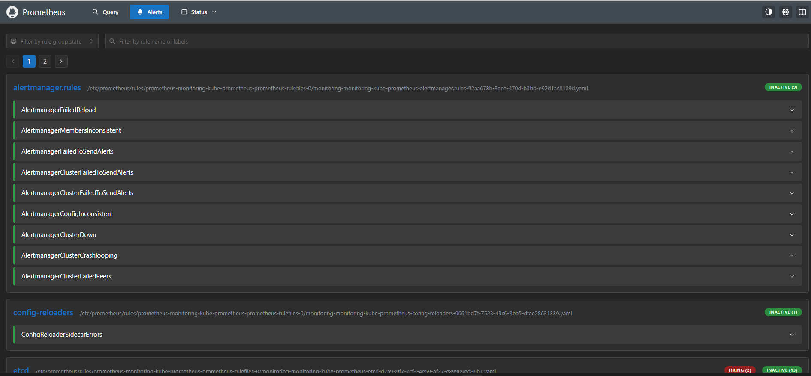
### Grafana Overview Dashboard

Grafana provides an overall view of monitoring data collected from Prometheus, including request metrics, latency, and active alerts.

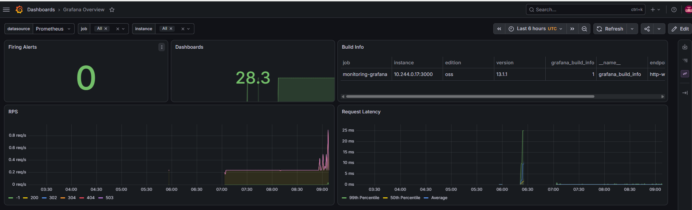
### Kubernetes Cluster Dashboard

This dashboard visualizes CPU, memory, workload, and resource utilization across the Kubernetes cluster.

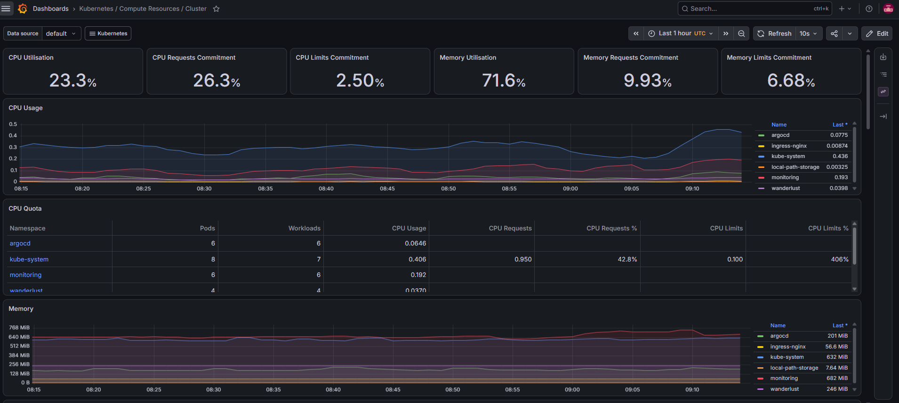
### Kubernetes Networking Dashboard

Network traffic, bandwidth usage, and communication between Kubernetes components are monitored through dedicated networking dashboards.

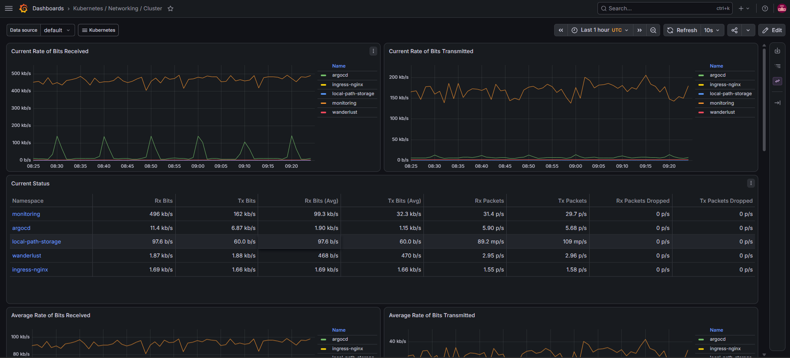
### Alertmanager Dashboard

Alertmanager manages alerts generated by Prometheus, providing alert grouping, routing, silencing, and notification management.

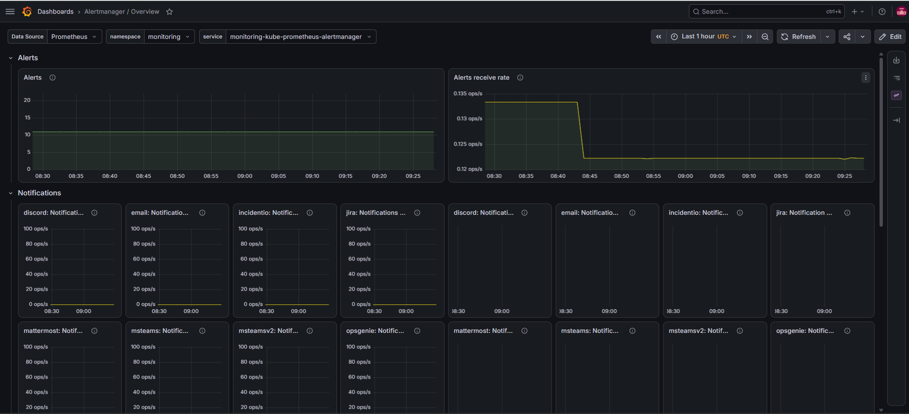
---

# 🌐 Application Demo

The following screenshot shows the Wanderlust application successfully deployed on Kubernetes through the complete DevSecOps and GitOps pipeline.

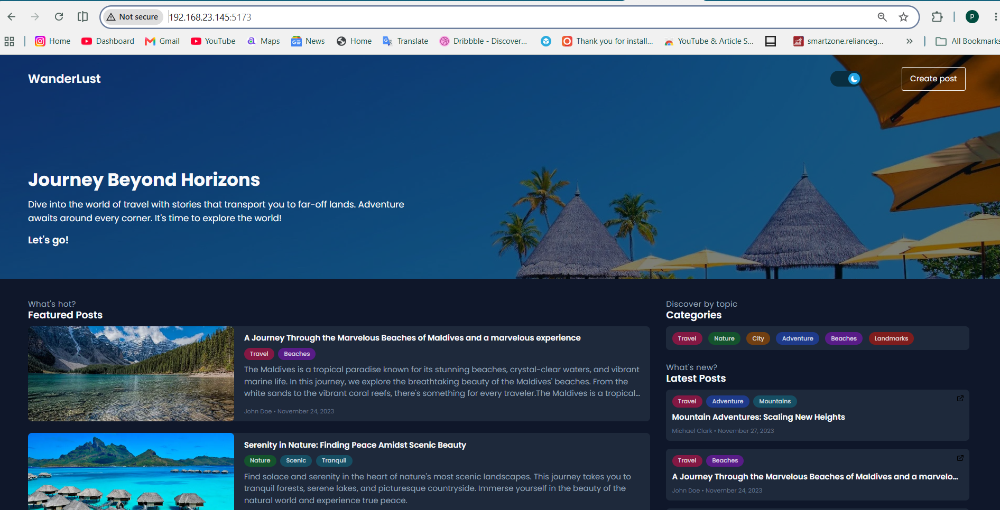
---

# 🛠 Technology Stack

| Category | Technologies |
|----------|--------------|
| Programming Languages | Java, JavaScript |
| Frontend | React, Vite |
| Backend | Spring Boot |
| Database | MongoDB, Redis |
| CI/CD | Jenkins |
| Code Quality | SonarQube |
| Security Scanning | Trivy, OWASP Dependency Check |
| Containerization | Docker |
| Container Registry | Docker Hub |
| Orchestration | Kubernetes |
| GitOps | ArgoCD |
| Monitoring | Prometheus |
| Visualization | Grafana |
| Alerting | Alertmanager |
| Version Control | Git, GitHub |

---

# 📁 Repository Structure

```text
Wanderlust-Mega-Project/
├── Assets/                  # Project assets and documentation resources
├── Automations/             # Automation scripts
├── backend/                 # Node.js + Express backend application
├── database/                # Database initialization scripts
├── frontend/                # React + Vite frontend application
├── GitOps/                  # GitOps automation scripts
├── kubernetes/              # Kubernetes deployment manifests
├── screenshots/             # README screenshots
│   ├── application/         # Application UI screenshots
│   ├── cicd/                # Jenkins pipeline screenshots
│   ├── gitops/              # ArgoCD screenshots
│   ├── kubernetes/          # Kubernetes resources screenshots
│   └── monitoring/          # Prometheus, Grafana, Alertmanager screenshots
├── Jenkinsfile              # Jenkins CI/CD pipeline definition
├── docker-compose.yml       # Local containerized environment
├── LICENSE
└── README.md
```
---

# 🚀 Installation Guide

## 📋 Prerequisites

Before running this project, ensure the following tools are installed:

- Git
- Docker
- Docker Compose
- kubectl
- Kind Kubernetes Cluster
- Helm
- Jenkins (for CI/CD pipeline)
- ArgoCD (for GitOps deployment)


## 📥 Clone Repository

Clone the project repository:

```bash
git clone https://github.com/<your-username>/Wanderlust-Mega-Project.git

cd Wanderlust-Mega-Project
```


# 🐳 Local Deployment using Docker Compose

For local development, the application can be started using Docker Compose.

### Start Application Containers

```bash
docker compose up -d
```

Check running containers:

```bash
docker ps
```

The application services will start with:

- Frontend
- Backend
- MongoDB
- Redis


### Stop Application

```bash
docker compose down
```


# ☸️ Kubernetes Deployment

The application is deployed on Kubernetes using production-style manifests.

## Create Kubernetes Cluster

Create a Kind cluster:

```bash
kind create cluster --name wanderlust-control-plane
```


## Deploy Application Components

Apply Kubernetes manifests:

```bash
kubectl apply -f kubernetes/
```


## Verify Kubernetes Resources

Check pods:

```bash
kubectl get pods -n wanderlust
```

Check services:

```bash
kubectl get svc -n wanderlust
```


## Access Application

Frontend:

```text
http://localhost:5173
```

Backend API:

```text
http://localhost:8080
```


# 🔄 GitOps Deployment using ArgoCD

Install ArgoCD:

```bash
kubectl create namespace argocd

kubectl apply -n argocd \
-f https://raw.githubusercontent.com/argoproj/argo-cd/stable/manifests/install.yaml
```

Access ArgoCD UI:

```bash
kubectl port-forward svc/argocd-server \
-n argocd 8080:443
```


Sync application through ArgoCD:

```bash
kubectl get applications -n argocd
```

The application will automatically synchronize with the GitOps repository.
---

# 🔄 CI/CD Pipeline Workflow

The Wanderlust project implements a complete **DevSecOps CI/CD pipeline** using Jenkins, SonarQube, Trivy, Docker, and GitHub.

The pipeline automates source code validation, security scanning, quality analysis, container image creation, and GitOps repository updates.


## 🏗️ CI/CD Pipeline Architecture

```text
Developer Push Code
          |
          ↓
       GitHub Repository
          |
          ↓
        Jenkins Pipeline
          |
          |
          ├── Source Code Checkout
          |
          ├── Trivy Filesystem Security Scan
          |
          ├── OWASP Dependency Check
          |
          ├── SonarQube Code Quality Analysis
          |
          ├── Docker Image Build
          |
          ├── Docker Image Push
          |
          └── Update GitOps Repository
                    |
                    ↓
              ArgoCD Sync
                    |
                    ↓
            Kubernetes Deployment
```


# ⚙️ Jenkins Pipeline Stages

## 1. Source Code Checkout

Jenkins automatically pulls the latest application source code from GitHub.


## 2. Security Scanning

### Trivy Filesystem Scan

Scans application source code for:

- Vulnerable dependencies
- Security issues
- Misconfigurations


### OWASP Dependency Check

Identifies known vulnerabilities in project dependencies.


## 3. Code Quality Analysis

### SonarQube Integration

SonarQube performs:

- Code quality analysis
- Bug detection
- Code smell identification
- Security hotspot analysis


## 4. Docker Image Build

Jenkins builds production-ready Docker images:

```bash
docker build -t wanderlust-backend .
docker build -t wanderlust-frontend .
```


## 5. Docker Image Push

Successfully tested images are pushed to Docker Hub:

```text
Docker Hub
     |
     ├── Backend Image
     |
     └── Frontend Image
```


## 6. GitOps Repository Update

After pushing images, Jenkins automatically updates Kubernetes manifests in the GitOps repository with the latest image tags.


## 7. Deployment Trigger

ArgoCD continuously monitors the GitOps repository.

When changes are detected:

```
GitOps Repository Change
            |
            ↓
        ArgoCD Sync
            |
            ↓
      Kubernetes Deployment
```


# ✅ CI/CD Pipeline Benefits

- Automated build and deployment process
- Integrated security scanning
- Continuous code quality monitoring
- Containerized application delivery
- GitOps-based Kubernetes deployment
- Reduced manual deployment effort

```
---

# 🔁 GitOps Workflow

The Wanderlust project follows a **GitOps-based deployment approach** using ArgoCD and Kubernetes.

In this workflow, the GitOps repository acts as the single source of truth for Kubernetes deployment configurations.

Any application change flows through Git commits, automated image updates, and ArgoCD synchronization.


## 🏗️ GitOps Architecture

```text
Developer
    |
    ↓
Application Source Code
    |
    ↓
GitHub Repository
    |
    ↓
Jenkins CI/CD Pipeline
    |
    ├── Build Docker Image
    |
    ├── Push Image to Docker Hub
    |
    └── Update Image Tag
             |
             ↓
       GitOps Repository
             |
             ↓
          ArgoCD
             |
             ↓
     Kubernetes Cluster
             |
             ↓
    Wanderlust Application
```


# ⚙️ GitOps Deployment Flow

## 1. Code Change

Developer pushes application changes to the source repository.

Example:

```bash
git push origin main
```


## 2. CI Pipeline Execution

Jenkins automatically:

- Validates the code
- Performs security scans
- Builds Docker images
- Pushes images to Docker Hub


## 3. GitOps Repository Update

After a successful image build, Jenkins updates Kubernetes manifests with the latest image version.

Example:

```yaml
image:
  prasad3737/wanderlust-backend-beta:v3
```


## 4. ArgoCD Synchronization

ArgoCD continuously monitors the GitOps repository.

When a new commit is detected:

```text
GitOps Repository
        |
        ↓
    ArgoCD Detection
        |
        ↓
   Automatic Sync
        |
        ↓
 Kubernetes Resources Updated
```


## 5. Kubernetes Deployment

ArgoCD deploys and manages:

- Frontend Deployment
- Backend Deployment
- MongoDB Deployment
- Redis Deployment
- Services
- Persistent Volumes
- Ingress Configuration


# 🔐 GitOps Advantages

- Git as the single source of truth
- Automated Kubernetes deployments
- Version-controlled infrastructure
- Easy rollback capability
- Improved deployment reliability
- Reduced manual configuration changes

```
---

# 📊 Monitoring & Alerting Workflow

The Wanderlust application uses a complete monitoring and observability stack with **Prometheus, Grafana, and Alertmanager**.

This setup provides real-time visibility into Kubernetes resources, application health, performance metrics, and failure detection.


## 🏗️ Monitoring Architecture

```text
                Kubernetes Cluster
                       |
                       |
        ┌──────────────┴──────────────┐
        |                             |
        ↓                             ↓
 Prometheus                    Node Exporter
        |
        |
        ↓
  Metrics Collection
        |
        ↓
     Grafana
        |
        ↓
 Dashboards & Visualization


        Prometheus
             |
             ↓
    Alert Rules (PrometheusRule)
             |
             ↓
       Alertmanager
             |
             ↓
      Alert Notifications
```


# ⚙️ Monitoring Components


## 🔍 Prometheus

Prometheus is used for collecting and storing Kubernetes and application metrics.

Monitored resources include:

- Kubernetes pods
- Nodes
- Deployments
- Services
- Container metrics
- Application availability


## 📈 Grafana

Grafana provides visualization dashboards for monitoring system health.

Implemented dashboards include:

- Kubernetes cluster monitoring
- Node resource utilization
- Pod performance
- Application metrics


## 🚨 Alertmanager

Alertmanager handles alerts generated by Prometheus rules.

It provides:

- Alert grouping
- Alert routing
- Notification management


# 🔔 Application Alerting Workflow

The project includes custom Prometheus alert rules for application monitoring.


Example:

```yaml
alert: WanderlustBackendDown
expr: kube_pod_status_phase{
namespace="wanderlust",
phase!="Running"
} == 1

for: 2m

labels:
  severity: critical
```


Alert flow:

```text
Backend Pod Failure
        |
        ↓
 Prometheus Detects Issue
        |
        ↓
 Alert Rule Triggered
        |
        ↓
 Alertmanager Processing
        |
        ↓
 Notification Sent
```


# ✅ Monitoring Benefits

- Real-time Kubernetes visibility
- Application availability monitoring
- Automated failure detection
- Faster troubleshooting
- Production-level observability
- Improved reliability

```
---

# 🚀 Future Enhancements

The Wanderlust DevSecOps platform can be further enhanced with additional cloud-native and enterprise-grade capabilities.


## ☁️ Cloud Deployment

- Deploy the Kubernetes infrastructure on managed cloud platforms:

  - AWS EKS
  - Azure Kubernetes Service (AKS)
  - Google Kubernetes Engine (GKE)

- Implement cloud-native networking and security best practices.


## 📦 Helm Chart Implementation

- Convert Kubernetes manifests into reusable Helm charts.
- Simplify application deployment and version management.
- Support multiple environments like:

  - Development
  - Staging
  - Production


## 🔐 Advanced Security Integration

Enhance the DevSecOps pipeline with additional security tools:

- Container image vulnerability scanning
- Kubernetes security scanning
- Secrets management using:

  - HashiCorp Vault
  - Kubernetes Secrets encryption


## 📊 Advanced Observability

Improve monitoring capabilities with:

- Custom application metrics
- Distributed tracing using OpenTelemetry
- Centralized logging using:

  - Elasticsearch
  - Logstash
  - Kibana (ELK Stack)


## 🔄 Multi-Environment GitOps

Implement separate GitOps workflows for:

- Development environment
- Testing environment
- Production environment

Using:

- ArgoCD Applications
- ApplicationSets
- Environment-specific configurations


## 📈 Scalability Improvements

Introduce:

- Horizontal Pod Autoscaling (HPA)
- Cluster autoscaling
- Load balancing optimization
- High availability architecture


## 🤖 Automation Improvements

Enhance automation using:

- Infrastructure as Code with Terraform
- Configuration management with Ansible
- Automated testing pipelines

```
---

# 📄 License

This project is licensed under the **MIT License**.

You are free to use, modify, and distribute this project in accordance with the terms of the MIT License.

For more details, see the [LICENSE](LICENSE) file.

---

# 👨‍💻 Author

**Prasad Harischandra Jadhav**

Electronics & Telecommunication Engineer | DevSecOps & Cloud Enthusiast

### 📫 Connect With Me

- **GitHub:** https://github.com/prasad3737
- **LinkedIn:** https://www.linkedin.com/in/prasad-jadhav-19a35b413
- **Email:** pj344504@gmail.com

---

⭐ If you found this project helpful, please consider giving it a **Star** on GitHub!
